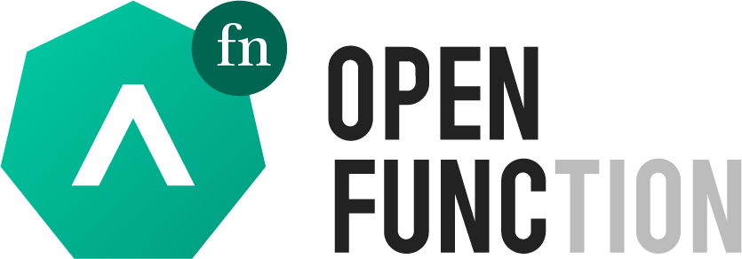

# 

`cli` is the command-line interface for [OpenFunction](https://github.com/OpenFunction/OpenFunction).

The `cli` repo is used to track issues for the `OpenFunction`. This tool allows you to focus on the core functionality of the OpenFunction, while also presents the relationship between the OpenFunction and its dependent components in a more abstract and friendly way.

## Main commands
The main commands supported by the CLI are:
- init: provides management for openfunction’s framework.
- install: installs OpenFunction and its dependencies.
- uninstall: uninstalls OpenFunction and its dependencies.
- create: creates a function from a file or stdin.
- apply: applies a function from a file or stdin.
- get: prints a table of the most important information about the specified function.
  - get builder: prints important information about the builder.
  - get serving: prints important information about the serving.
- delete: deletes the specified function.

## Getting started

Visit [ofn releases page](https://github.com/OpenFunction/cli/releases/) to download the `ofn` cli to deploy to your cluster.

### Use ofn to deploy OpenFunction

> Make sure you put the artifacts from the above step under the appropriate path in `PATH` and rename it `ofn`. 

Run `ofn install --all` to implement a simple deployment. By default, this command will install the *v0.4.0* version of OpenFunction and skips the installation of components that already exist. To overwrite the existing components, use the `--upgrade` command. 

For more information, refer to the [ofn install document](docs/install.md).

```shell
# ofn install --all --upgrade
Start installing OpenFunction and its dependencies.
Here are the components and corresponding versions to be installed:
+------------------+---------+
| COMPONENT        | VERSION |
+------------------+---------+
| Kourier          | 1.0.1   |
| Keda             | 2.4.0   |
| Tekton Pipelines | 0.30.0  |
| OpenFunction     | 0.4.0   |
| Dapr             | 1.5.1   |
| CertManager      | 1.1.0   |
| Shipwright       | 0.6.1   |
| Knative Serving  | 1.0.1   |
| DefaultDomain    | 1.0.1   |
+------------------+---------+
You have used the `--upgrade` parameter, which means that the installation process will overwrite the components that already exist.
Make sure you know what happens when you do this.
Enter 'y' to continue and 'n' to abort:
-> y
🔄  -> INGRESS <- Installing Ingress...
🔄  -> KNATIVE <- Installing Knative Serving...
🔄  -> DAPR <- Installing Dapr...
🔄  -> DAPR <- Downloading Dapr Cli binary...
🔄  -> KEDA <- Installing Keda...
🔄  -> CERTMANAGER <- Installing Cert Manager...
🔄  -> SHIPWRIGHT <- Installing Shipwright...
🔄  -> INGRESS <- Checking if Ingress is ready...
🔄  -> KEDA <- Checking if Keda is ready...
🔄  -> CERTMANAGER <- Checking if Cert Manager is ready...
🔄  -> SHIPWRIGHT <- Checking if Shipwright is ready...
🔄  -> KNATIVE <- Installing Kourier as Knative's gateway...
🔄  -> KNATIVE <- Configuring Knative Serving's DNS...
🔄  -> KNATIVE <- Checking if Knative Serving is ready...
✅  -> CERTMANAGER <- Done!
🔄  -> DAPR <- Initializing Dapr with Kubernetes mode...
✅  -> SHIPWRIGHT <- Done!
✅  -> KNATIVE <- Done!
✅  -> INGRESS <- Done!
✅  -> DAPR <- Done!
✅  -> KEDA <- Done!
🔄  -> OPENFUNCTION <- Installing OpenFunction...
🔄  -> OPENFUNCTION <- Checking if OpenFunction is ready...
✅  -> OPENFUNCTION <- Done!
🚀 Completed in 2m3.638035129s.
```

### Use ofn to uninstall OpenFunction

> Make sure you put the artifacts from the above step under the appropriate path in `PATH` and rename it `ofn`. 

Run `ofn uninstall --all` to uninstall OpenFunction and its dependencies (or just uninstall OpenFunction without arguments).

For more information, refer to the [ofn uninstall document](docs/uninstall.md).

```shell
~# ofn uninstall --all
Start uninstalling OpenFunction and its dependencies.
The following components already exist:
+------------------+---------+
| COMPONENT        | VERSION |
+------------------+---------+
| Cert Manager     | v1.5.4  |
| Ingress Nginx    | 1.1.0   |
| Tekton Pipelines | v0.28.1 |
| Shipwright       | 0.6.0   |
| OpenFunction     | v0.4.0  |
| Dapr             | 1.4.3   |
| Keda             | 2.4.0   |
| Knative Serving  | 0.26.0  |
+------------------+---------+
You can see the list of components to be uninstalled and the list of components already exist in the cluster.
Make sure you know what happens when you do this.
Enter 'y' to continue and 'n' to abort:
-> y
🔄  -> OPENFUNCTION <- Uninstalling OpenFunction...
🔄  -> KNATIVE <- Uninstalling Knative Serving...
🔄  -> DAPR <- Uninstalling Dapr with Kubernetes mode...
🔄  -> KEDA <- Uninstalling Keda...
🔄  -> SHIPWRIGHT <- Uninstalling Tekton Pipeline & Shipwright...
🔄  -> INGRESS <- Uninstalling Ingress...
🔄  -> CERTMANAGER <- Uninstalling Cert Manager...
✅  -> OPENFUNCTION <- Done!
✅  -> DAPR <- Done!
🔄  -> KNATIVE <- Uninstalling Kourier...
✅  -> KEDA <- Done!
✅  -> CERTMANAGER <- Done!
✅  -> KNATIVE <- Done!
✅  -> INGRESS <- Done!
✅  -> SHIPWRIGHT <- Done!
🚀 Completed in 1m21.683329262s.
```

### Build OpenFunction CLI

To build the OpenFunction CLI——`ofn`, run `make build`.
When the command is executed, you can find the artifact in the `. /dist` directory.
Move it to an appropriate path in the `PATH` so that you can use it in your environment.

```shell
~# make build
go fmt ./...
/opt/openfunction/fn-cli/bin/goimports -w cmd/ pkg/ testdata/
go vet ./...
CGO_ENABLED=0 GOOS=linux GOARCH=amd64 go build  -ldflags "-s -w -X 'main.goversion=go version go1.16.7 linux/amd64'" \
-o ./dist/fn_linux_amd64 cmd/main.go;
```

### 
